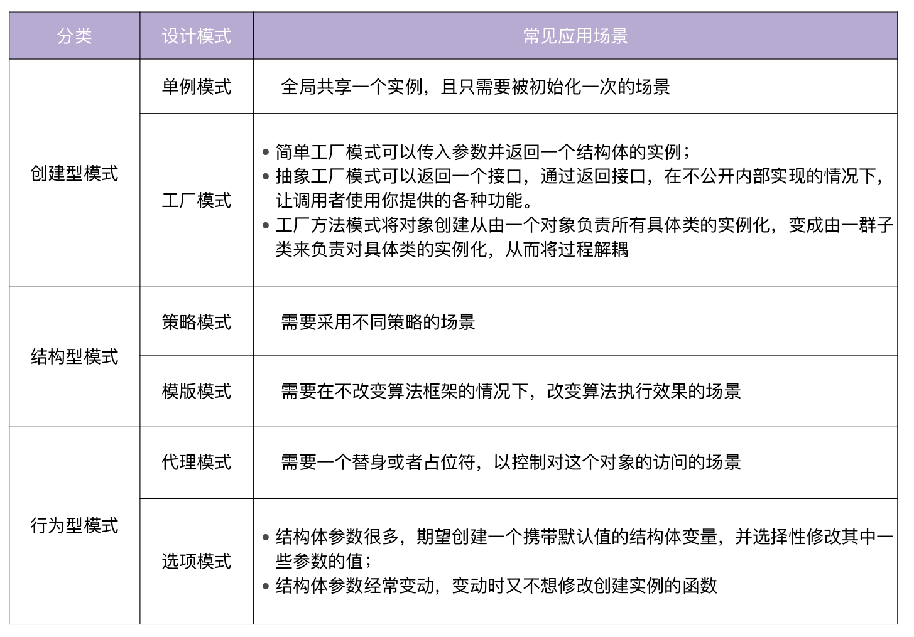

### Go 语言项目开发实战

#### 参考资料
* [Go 语言项目开发实战](https://time.geekbang.org/column/intro/100079601?tab=catalog)

#### 第1站 规范设计
```
Commit Message 规范：
<type>[optional scope]: <description>

[optional body]

[optional footer]
```
* type说明了commit的类型，常用类型见[链接](../images/combat/commit-message.png)
* scope说明了commit的影响范围的，见[示例](https://github.com/marmotedu/iam/blob/master/docs/devel/zh-CN/scope.md)
* description是对commit的简短描述
* body是对commit的更详细的描述
* footer常用的有两种：
  * BREAKING CHANG: xxx。表示不兼容的改动
  * Closes #1, #2。关闭了2个issue
* 功能分支工作流，[三种合并代码方式的差别](https://www.chenshaowen.com/blog/the-difference-of-tree-ways-of-merging-code-in-github.html)
* Git Flow工作流，介绍见[链接](https://blog.csdn.net/weixin_46674610/article/details/115396404)



#### 第2站 基础功能
* RESTful API
  * API版本，参考github的header头，X-GitHub-Api-Version: 2022-11-28
  * API命名，参考github的https://api.github.com/orgs/ORG/actions/permissions/selected-actions
* GRPC
  * [关于 protoc 工具的小疑惑](https://learnku.com/articles/64337)
  * go install google.golang.org/protobuf/cmd/protoc-gen-go
  * go install google.golang.org/grpc/cmd/protoc-gen-go-grpc
  * protoc -I. --go_out=. *.proto
  * protoc -I. --go-grpc_out=. *.proto
* 错误处理-http状态码
  * 200 - 表示请求成功执行。
  * 400 - 表示客户端出问题。
  * 500 - 表示服务端出问题。
  * 401 - 表示认证失败。
  * 403 - 表示授权失败。
  * 404 - 表示资源找不到
  * 405 - Method Not Allowed
* 错误处理-业务错误码，以新浪的100101为例
  * 10: 服务。
  * 01: 服务下的某个模块。
  * 01: 模块下的错误码序号
* 错误处理-接口返回字段：code、message、reference、data
