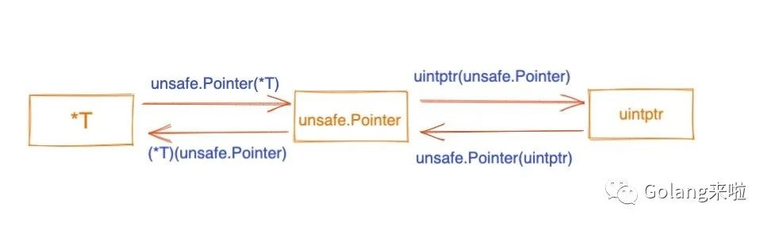

### Go 汇编相关

#### 常用指令，[肝了一上午golang之plan9入门](https://studygolang.com/articles/33163)

```
//数据copy
LEAQ 5(AX*2), BX // BX=AX*2+5
MOVQ $123, AX    // AX=123
MOVQ $0x123, AX  // AX=291
MOVB $1, DI      // 1 byte
MOVW $0x10, BX   // 2 bytes
MOVD $1, DX      // 4 bytes
MOVL $1, DX      // 4 bytes
MOVQ $-10, AX    // 8 bytes
XCHG DST,SRC     // 交换DST,SRC的值，DST,SRC不能同时是内存

//SIMD
movups: 把(16B)4个不对准的单精度值传送到xmm寄存器或者内存
movaps: 把(16B)4个对准的单精度值传送到xmm寄存器或者内存

//计算指令
ADDQ AX, BX  // BX += AX
SUBQ AX, BX  // BX -= AX
IMULQ AX, BX // BX *= AX

//跳转指令
JMP addr   // 跳转到地址，地址可为代码中的地址 不过实际上手写不会出现这种东西
JMP label  // 跳转到标签 可以跳转到同一函数内的标签位置
JMP 2(PC)  // 以当前置顶为基础，PC+2
JMP -2(PC) // 以当前置顶为基础，PC-2
JNZ target // 如果zero flag被set过，则跳转
CMPQ SI CX 
JLS 0x0185 // 如果SI<CX，则跳转到0x0185
TEST AX, AX
JE 0x0185  // 如果AX & AX==0，则跳转到0x0185(意思是判断AX是否等于0，它比CMP指令更快)
TEST AX, BX
JE 0x0185  // 如果AX & BX==0，则跳转到0x0185(TEST指令不会改变AX/BX)

//栈扩大和缩小（没有用push、pop）
SUBQ $0x18, SP // 对SP做减法，为函数分配函数栈帧
ADDQ $0x18, SP // 对SP做加法，清除函数栈帧

//定义函数
TEXT fun·Swap(SB),NOSPLIT,$0-32 
//fun是包名
//Swap是方法名
//若不指定NOSPLIT，argsize必须指定
//$0-32表示framesize和argsize

//参考https://golang.design/under-the-hood/zh-cn/part1basic/ch01basic/asm/
//FUNCDATA 和 PCDATA 指令包含了由垃圾回收器使用的信息，他们由编译器引入。
DATA divtab<>+0x00(SB)/4, $0xf4f8fcff  // 表示的是divtab<>在0偏移处有一个4字节大小的值0xf4f8fcff
...
DATA divtab<>+0x3c(SB)/4, $0x81828384
GLOBL divtab<>(SB), RODATA, $64        // 给变量divtab<>加上RODATA只读标识，并声明占用64字节（3c+4=64）
```

#### 四个伪寄存器，[plan9 汇编入门](https://github.com/cch123/golang-notes/blob/master/assembly.md#%E4%BC%AA%E5%AF%84%E5%AD%98%E5%99%A8)
* SB: Static base pointer(全局静态基指针)，一般用来声明函数或全局变量
* PC: Program counter(PC 寄存器)
* FP: Frame pointer(帧指针)，用来标识传参、返回值。arg0+0(FP)表示第一个传参
* SP: Stack pointer(栈指针)
  * 伪SP：指向当前栈帧的局部变量的开始位置。var0-8(SP)表示第一个局部变量(var0占8B)
  * 硬件SP：函数栈真实栈顶地址。var0+0(SP)表示第一个局部变量
* 伪SP和硬件SP的关系：
  * 若没有本地变量：伪SP=硬件SP+8
  * 若有本地变量：伪SP=硬件SP+16+本地变量空间大小
  * 如果是手写plan9，且如果是symbol+offset(SP)形式，则表示伪SP。如果是offset(SP)则表示硬件SP。
  * 如果是go tool objdump/go tool compile -S -N -l，看到的都是硬件SP。

#### Go语言的编译指示，[Go 语言编译器](https://segmentfault.com/a/1190000016743220)
* //go:noinline：不要内联。例如"new" + word：
  * 不加此提示，编译器会吧appendStr函数直接搬过来，这是编译器默认做的优化
  * 加了此提示，则是call appendStr
* //go:nosplit：跳过栈溢出检查。加上此提示可提高性能，但是可能会stack overflow
* //go:noescape：禁止逃逸  
* go tool compile -S -N -l //-l是禁止内联 -N是禁止优化 -S是输出汇编代码

#### argsize和framesize计算规则，[plan9 汇编入门](https://github.com/cch123/golang-notes/blob/master/assembly.md#argsize-%E5%92%8C-framesize-%E8%AE%A1%E7%AE%97%E8%A7%84%E5%88%99)

```
/*
argsize
1. Go 在函数调用时，参数和返回值都需要由 caller 在其栈帧上备好空间。callee 在声明时仍然需要知道这个 argsize。
2. argsize = 参数大小求和 + 返回值。但需要考虑内存对齐
*/

/*
framesize
1. 需要计算局部变量及其每个变量的size
2. 如果还调用了其他函数，需要计算callee的参数、返回值，但是不需要考虑return address(8字节)
   因为开辟return address空间由call指令自动完成，ret指令自动回收
3. 手写plan9不需要计算caller BP(8字节)，caller BP 是在编译期由编译器插入的   
*/
                                  caller                                                                           
                            +------------------+                                                                   
                            |                  |                                                                   
      +------------------>  --------------------                                                                   
      |                     | caller parent BP |                                                                   
      |       BP(pseudo SP) --------------------                                                                   
      |                     |   Local Var0     |                                                                   
      |                     --------------------                                                                   
      |                     |   .......        |                                                                   
      |                     --------------------                                                                   
      |                     |   Local VarN     |                                                                   
                            --------------------                                                                   
caller stack frame          |                  |                                                                   
                            |   callee ret1    |                                                                   
      |                     |------------------|                                                                   
      |                     |   callee ret0    |                                                                   
      |                     |------------------|                                                                   
      |                     |   callee arg1    |                                                                   
      |                     |------------------|                                                                   
      |                     |   callee arg0    |                                                                   
      |                     ----------------------------------------------+ FP(virtual register)                 
      |                     |   return addr    |  parent return address   |                                        
      +------------------>  +------------------+---------------------------  <-----------------+         
                                               |     caller BP            |                    |         
                                BP(pseudo SP)  ----------------------------                    |         
                                               |     Local Var0           |                    |         
                                               ----------------------------                    |         
                                               |     Local Var1           |                              
                                               ----------------------------            callee stack frame
                                               |       .....              |                              
                                               ----------------------------                    |         
                                               |     Local VarN           |                    |         
                             SP(Real Register) ----------------------------                    |         
                                               |                          |                    |         
                                               +--------------------------+  <-----------------+         
                                                         callee
```

#### 数据结构，[plan9 汇编入门](https://github.com/cch123/golang-notes/blob/master/assembly.md#argsize-%E5%92%8C-framesize-%E8%AE%A1%E7%AE%97%E8%A7%84%E5%88%99)
* 数值类型：int/int8/int16/int32/int64、uint/uint8/uint16/uint32/uint64、float32/float64、byte/rune、uintptr、bool
* array和slice，[深入剖析slice和array](https://blog.thinkeridea.com/201901/go/shen_ru_pou_xi_slice_he_array.html)
  * array：和C语言一样是连续分配的内存，函数传参是值传递
  * slice：有三个元素*Elem、len、cap。len<1024则扩容成cap x 2；len>=1024则扩容成cap x 1.25
  * 零切片：var s = make([]int, 10) // 分配了内存，但元素都是零值
  * 空切片：var s = make([]int, 0) //未分配内存，*Elem指向zerobase这个特殊指针
  * nil切片：var s []int //未分配内存，*Elem值为nil
* string：有两个元素*Elem、len
* struct：是连续分配的内存
* map
* channel
* func
* interface
* 类型转换和类型断言：
  * 类型转换针对非接口类型，例如int和float64可以相互转换
  * 类型断言针对接口类型
* [浅析 unsafe.Pointer 与 uintptr](https://mp.weixin.qq.com/s/xyfCR57cd5mNRRsOKvrFRA)



