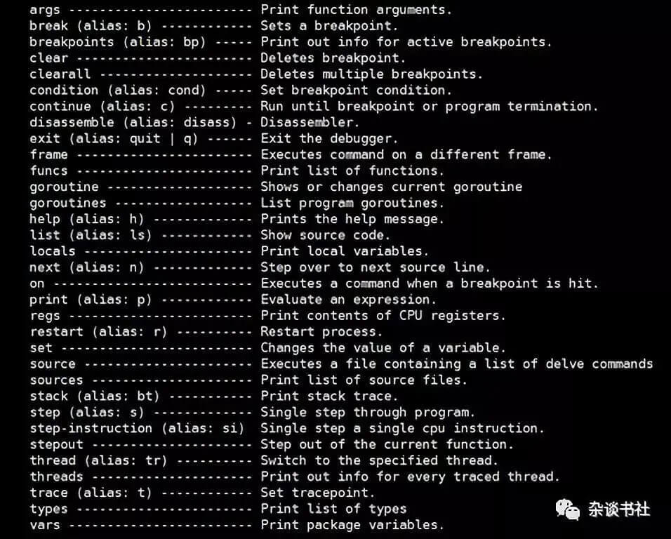

### Go dlv调试

#### dlv用法
```
// 本文的开发环境
go version
go version go1.17.3 linux/amd64
// 安装dlv命令
go get github.com/go-delve/delve/cmd/dlv
// 编译并进入调试模式
go build -gcflags=all="-N -l" hello.go
dlv exec ./hello
b main.main
c

// 常用命令
n                          执行go代码的下一行代码
regs                       打印所有寄存器的值
help regs                  获取regs命令的帮助说明
p var0                     打印var0
x -count 24 -size 8 0x10a0 打印0x10a0地址的值，8字节一组，共24组
```

#### dlv常用命令


#### slice的内存结构
```
func main() {
	hash := make([]int, 9, 98)
	hash[0] = 1
	hash[1] = 2
	hash[2] = 3
	say(hash)
}
//go:noinline
func say(hash2 []int) {
	hash2[3] = 4
	_ = hash2
}
// 编译并进入调试模式后执行
b main.say
c
// 此时寄存器rax=&hash2.data、rbx=hash2.len、rcx=hash2.cap
```

#### map的内存结构
```
func main() {
	hash := make(map[string]int, 24)
	say(hash)
}

//go:noinline
func say(hash2 map[string]int) {
	fmt.Printf("%v\n", getHMap(hash2))
}

func getHMap(m interface{}) *hmap {
	ei := (*emptyInterface)(unsafe.Pointer(&m))
	return (*hmap)(ei.value)
}

type emptyInterface struct {
	_type unsafe.Pointer
	value unsafe.Pointer
}

type hmap struct {
	count      int
	flags      uint8
	B          uint8
	noverflow  uint16
	hash0      uint32
	buckets    unsafe.Pointer
	oldbuckets unsafe.Pointer
	nevacuate  uintptr
	extra      unsafe.Pointer
}

// 编译并进入调试模式后执行
b main.say
c
// 此时rax存储的即是hmap的地址
x -count 6 -size 8 0x000000c000074150
0xc000074150:   0x0000000000000000   0x69587b7700000200   0x000000c000078a80   0x0000000000000000   0x0000000000000000   0x0000000000000000
```

#### interface的iface结构
```
type Myintinterface interface {
	fun()
}
type Myint int
func (m Myint)fun()  {}

func main(){
	var mii Myintinterface = Myint(12)
	mii.fun()
}

/*
go tool compile -N -l -S hello.go查看itab
go.itab."".Myint,"".Myintinterface SRODATA dupok size=32 对应的是：
type itab struct {
	inter *interfacetype //对应type."".Myintinterface
	_type *_type         //对应type."".Myint
	hash  uint32
	_     [4]byte
	fun   [1]uintptr     //对应"".(*Myint).fun
}
type."".Myintinterface SRODATA size=104 对应的是：
type interfacetype struct {
	typ     _type        //1~48字节对应typ
	pkgpath name         //49~56字节对应pkgpath
	mhdr    []imethod    //57~104字节对应mhdr
}
type."".Myint SRODATA size=80 1~48字节对应_type：
type _type struct {
	size       uintptr
	ptrdata    uintptr
	hash       uint32
	tflag      uint8
	align      uint8
	fieldalign uint8
	kind       uint8
	alg        uintptr
	gcdata    *byte
	str       int32
	ptrToThis int32
}
type."".Myint SRODATA size=80 49~64字节对应uncommontype：
type uncommontype struct {
	pkgpath nameOff
	mcount  uint16 // number of methods
	_       uint16 // unused
	moff    uint32 // offset from this uncommontype to [mcount]method
                   // moff是uncommontype起点到[mcount]method偏移量
                   // 其中[mcount]method正是包含具体类型的所有方法。
	_       uint32 // unused
}
type."".Myint SRODATA size=80 65~80字节对应[mcount]method：
type method struct {
	name nameOff
	mtyp typeOff
	ifn  textOff
	tfn  textOff
}
*/
```