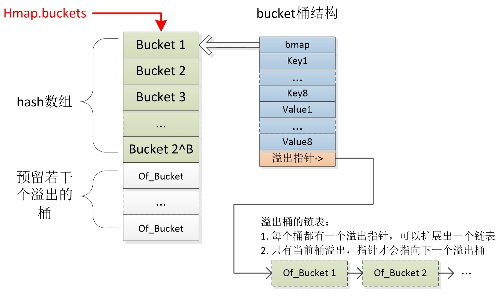

### Go 语言设计与实现

#### 参考资料
* [《Go 语言设计与实现》](https://book.douban.com/subject/35635836/)

#### 第二章 编译原理
* Go的编译器在逻辑上可以被分成四个阶段：
  1. 词法分析与语法分析：得到了每个文件对应的AST（抽象语法树）
  1. 类型检查和AST转换：检查语法错误，代码优化，把make和new改成对应操作类型
  1. 通用SSA生成：把AST生成SSA中间代码，对关键字再进行改写
  1. 最后的机器代码生成：根据Arch和OS生成对应机器码，需要用到汇编器
* 编译器一般分为前端和后端
  * 前端的主要工作是将源代码翻译成编程语言无关的中间表示，即Go的前2个阶段
  * 后端主要负责目标代码的优化和生成，即Go的后两个阶段

#### 第三章 数据结构
1. 数组：一块连续的内存
1. 切片：24字节，uintptr、len、cap
1. 哈希表：count(元素个数)、B(桶数量)、hash0(哈希种子)、buckets(桶数组)、oldbuckets(旧的桶数组)
1. 字符串：16字节，uintptr、len。每一次写操作都是开辟新的空间。

```
// arr := []int{1,2,3} 的汇编，这里的SP是硬件SP
	0x0014 00020 (hello.go:4)	MOVQ	$0, ""..autotmp_2+8(SP)  //arr[0]=0
	0x001d 00029 (hello.go:4)	LEAQ	""..autotmp_2+16(SP), AX 
	0x0022 00034 (hello.go:4)	MOVUPS	X15, (AX)              //arr[1]=0和arr[2]=0
	0x0026 00038 (hello.go:4)	MOVQ	$1, ""..autotmp_2+8(SP)  //arr[0]=1
	0x002f 00047 (hello.go:4)	MOVQ	$2, ""..autotmp_2+16(SP) //arr[1]=2
	0x0038 00056 (hello.go:4)	MOVQ	$3, ""..autotmp_2+24(SP) //arr[2]=3
	0x0041 00065 (hello.go:4)	LEAQ	""..autotmp_2+8(SP), AX  
	0x0046 00070 (hello.go:4)	MOVQ	AX, "".arr+32(SP)        //sliceHeader.data=&arr  
	0x004b 00075 (hello.go:4)	MOVQ	$3, "".arr+40(SP)        //sliceHeader.len=3
	0x0054 00084 (hello.go:4)	MOVQ	$3, "".arr+48(SP)        //sliceHeader.cap=3
```



#### 第四章 语言特性
* 函数调用：
  * 通过栈传递参数和返回值，内存地址高~低依次是：ret1、ret0、arg1、arg0
  * 调用函数都是值传递
* 接口分为eface接口和iface接口
* eface接口，不带任何方法
* iface接口，例如Duck接口，Cat结构体实现了Duck的方法：
  * 如果方法的接收者是结构体，即func (c Cat) Quack() {}
    * var a1 Duck = Cat{} //正常编译运行
    * var a2 Duck = &Cat{} //正常编译运行
  * 如果方法的接收者是结构体指针，即func (c *Cat) Quack() {}
    * var a1 Duck = Cat{} //编译报错
    * var a2 Duck = &Cat{} //正常编译运行
    * a1 := Cat{} //可正常调用a1.Quack()
  * eface.tab包含有\*interfacetype和*_type
    * *interfacetype表示抽象接口的信息
    * \*_type表示具体类型的信息，它和*interfacetype._type不相等
* 接口相关的文章
  * [深度解密Go语言之关于 interface 的10个问题](https://www.cnblogs.com/qcrao-2018/p/10766091.html)
  * [Go 和 interface 探究](https://xargin.com/go-and-interface/)
  * [通过汇编和源码两大神器探究 —— Go语言接口](https://blog.csdn.net/qq_31930499/article/details/102532264)
* 十种函数(方法)的调用形式
  * 直接调用顶级函数：println()
  * 直接调用一个值receiver的方法：(Cat{}).Quack()
  * 直接调用一个指针receiver的方法：(&Cat{}).Quack()
  * 间接调用一个interface的方法(包含有值方法的值)：var a Duck = Cat{} && a.Quack()
  * 间接调用一个interface的方法(包含有值方法的指针)：var a Duck = &Cat{} && a.Quack()
  * 间接调用一个interface的方法(包含有指针方法的指针)：var a Duck = &Cat{} && a.Quack()
  * 间接调用方法值(值等于顶级方法)：a = println
  * 间接调用方法值(值等于值方法)：a = (Cat{}).Quack
  * 间接调用方法值(值等于指针方法)：a = (&Cat{}).Quack
  * 间接调用方法值(值等于函数字面量)：a = func() {}

