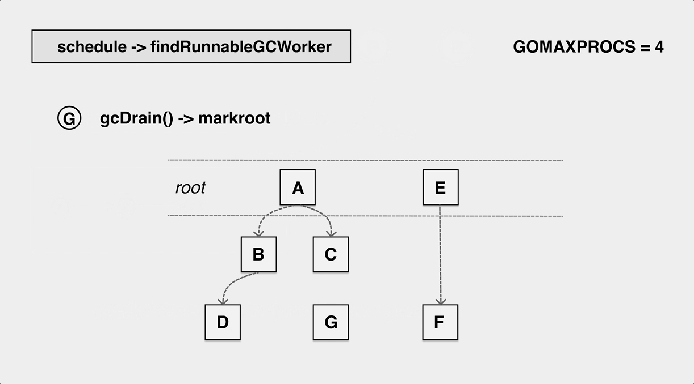
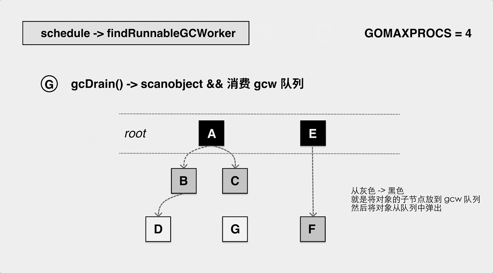
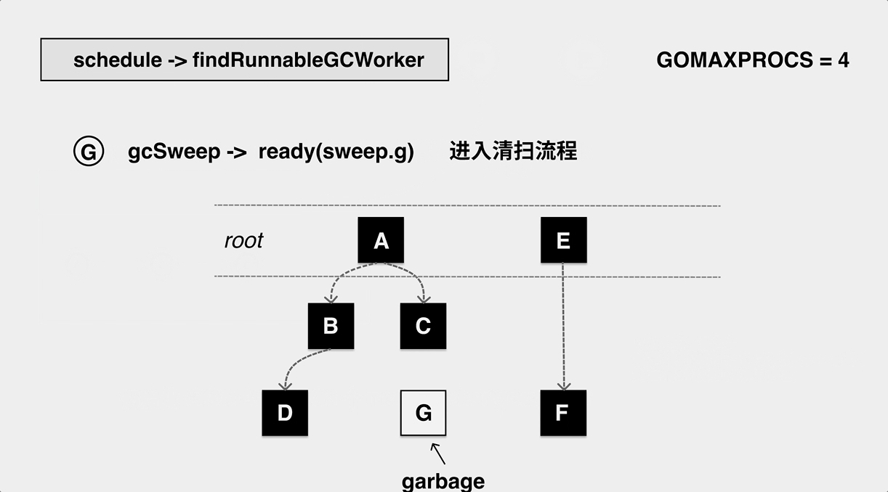
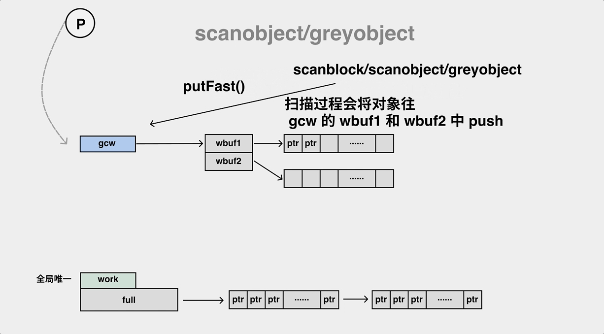
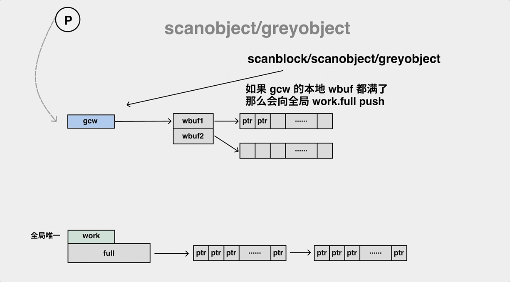
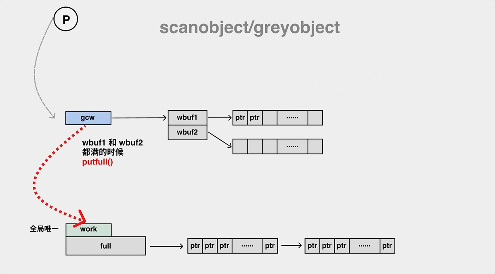
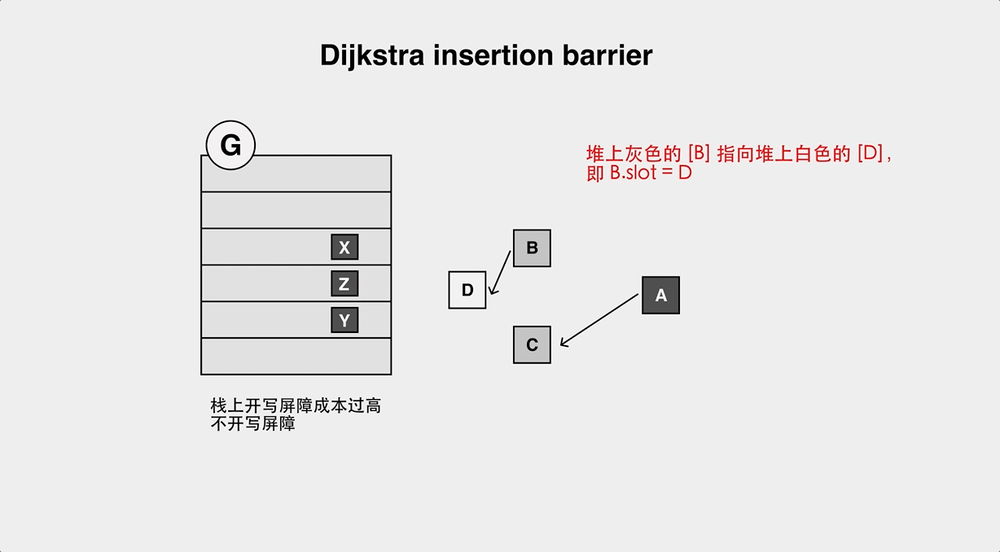
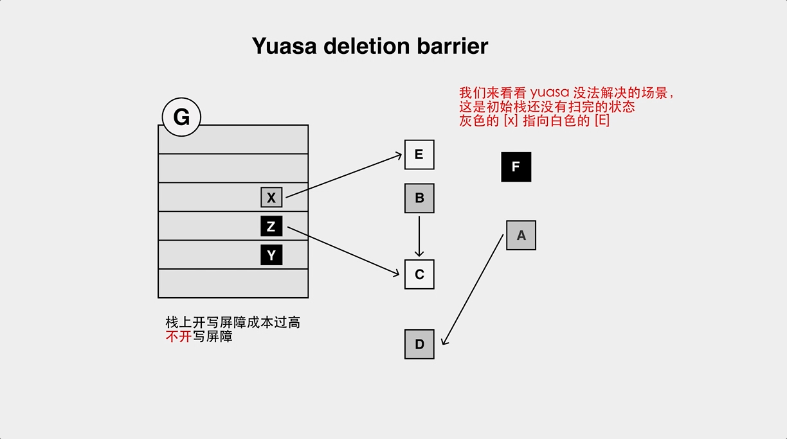
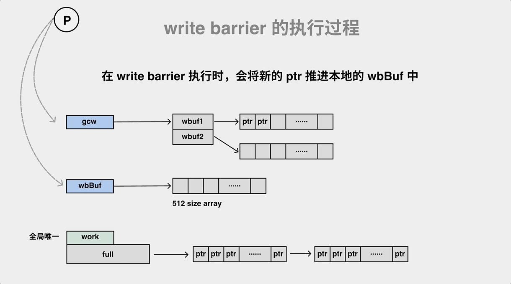

<link rel="stylesheet" href="../extra/ideal-image-slider.css">
<link rel="stylesheet" href="../extra/ideal-default-theme.css">

### GC 分析

#### 后台标记worker的工作过程

    
    
    
    
    
    
    
    
    

#### gcDrain.scanobject的具体过程

    
    
    
    

#### 插入写屏障对象丢失问题

    
    
    
    

#### 删除写屏障对象丢失问题

    
    
    
    
    

#### write barrier 的执行过程

    
    
    

