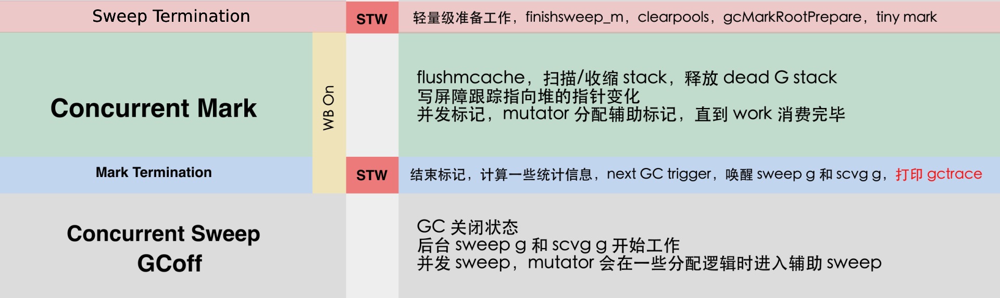

<link rel="stylesheet" href="../images/ideal-image-slider.css">
<link rel="stylesheet" href="../images/ideal-default-theme.css">

### GC 分析

#### 栈和堆的GC回收
* GC root的三个来源：
  * 全局数据区：data(全局变量)、bss(未初始化)、rodata(常量，[Go常量没有指针所以可以忽略](https://studygolang.com/resources/13965))
  * 栈：runtime.getStackMap()可以返回栈上localVals、args的指针位图
  * runtime.SetFinalizer()：GC发现一个不可达对象关联有finalizer函数，就调用它并取消关联finalizer函数，下一轮GC才回收
* 栈上不开启写屏障：如果开启需要生成大量代码，同时影响性能
* 全局数据区和堆区开启写屏障(runtime.SetFinalizer后变量逃逸到堆区)

#### GC 流程

* Concurrent Mark和Mark Termination都需要开启写屏障
* Concurrent Mark开始：所有G栈置灰
* Concurrent Mark阶段：G栈有三种状态
  * 灰色：栈未被扫描，指针赋值既有删除写屏障，又有插入写屏障
  * 黑色：栈已被扫描，指针赋值只有删除写屏障
  * 挂起：当前G暂停运行，标记栈上所有指针变量
* Concurrent Mark阶段：新的goroutine的栈直接标黑

